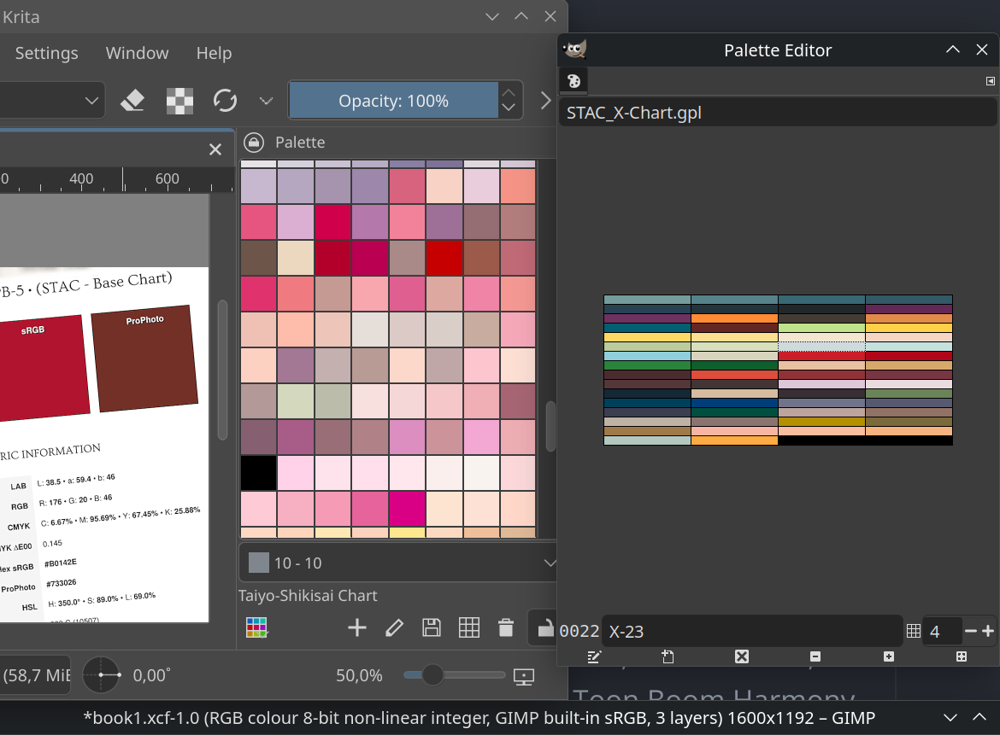

# Anime Cel Pigment References Preservation Project

> A comprehensive colourimetric database and processing pipeline for preserving and converting classic anime cel pigment charts to modern digital formats, maintaining accurate colour reproduction for contemporary animation production.

**Version:** 1.1 • **Release:** August 2025

---

## 🎨 Supported Pigment Systems

- **スタック (STAC: Saito Tele-Anima Colors Co. Ltd.)**
- **太陽色彩 (Taiyo-Shikisai / Animation Paint)**  
- **Cartoon Cel-Vinyl, Inc. Colour Charts**

---

## 📁 Project Contents

### Core Data Files

- **`colours_complete.json`** - Complete colorimetric database with Lab, RGB, Hex, HSL, and closest CMYK + Pantone values
- **`ORIGINAL_Cel_Animation_Color_Charts.xlsx`** - Original spectrophotometric measurements and source data
- **`./engine/`** - Python 3.8+ ready-to-use processors, generators, and utilities

---

### 📖 Publications

#### **Reference Charts**

- **`[BOOK-1]_Anime_CEL_Pigments_References.pdf`** - Professional reference charts (optimised for both sRGB display and accurate printing with ICC profiles)

#### **Technical Articles Collection**

#### Colour Design Notes

- **`[BOOK-2]ColourDesign_Memories-Tsujita_Kunio.pdf`** - Complete collection of Kunio Tsujita's colour design articles originally published at [AnimStyle Magazine](https://animestyle.jp/column/color-memo/), translated one-by-one.

---

### 🎯 Digital Palettes

> **Location:** `./engine/plugin_palettes/`

Generate palettes compatible with major creative applications using **`3: palette_generator.py`**.   

- **Ready-to-use palettes available at `./PALETTES...`**

#### Supported  Formats

| SOFTWARE                  | FORMAT                  |                                                                |
| ------------------------- | ----------------------- | -------------------------------------------------------------- |
| **GIMP Palette**          | `.gpl`                  | GIMP, open-source graphics tools                               |
| **(S)CSS Variables**      | `.css` / `.scss`        | Web development, RGB values to variables                       |
| **Unity Palette**         | `.cs` / `.unitypalette` | Unity/ C# objets palettes                                      |
| **Adobe Swatch Exchange** | `.ase`                  | Photoshop, Illustrator, Affinity, CorelDRAW                    |
| **Simple Text**           | `.txt`                  | Clip Studio Paint, PaintTool SAI, OpenToonz, Toon Boom Harmony |
| **Krita Palette**         | `.kpl`                  | Krita (with ICC) palette format                                |

---

## 🔧 Processing Tools

> If you need printed colour charts using your own ICC profile for printing, or wish to handle any aspect of pre-press file generation, the complete processing engine is available.

#### System Requirements

- **Python 3.8+** with required libraries (`pandas`, `PIL`, `colormath`, `reportlab`, `PyPDF`, `pikepdf`)
- **ICC-aware colour management system**
- **Wide-gamut display** recommended for accurate colour preview

---

### Colour Processing Engine

> **Location:** `./engine/`

#### **`1: main.py`** - Excel to JSON Processor

Converts Excel colour charts to JSON database with CMYK conversion and Pantone matching.

**Database Structure Requirements:**

- One complete colour chart per worksheet
- Columns for "Colour Name" and separate values (R, G, B, L*, a*, b*, Hex, H, S, L, C, M, Y, K, Delta values, etc. according to your measurements)

#### **`2: pdf_generator.py`** - PDF References Generator

Creates professional reference publications with custom ICC profile support for accurate printing, using PyPDF/PikePDF for custom procution.

---

### 📚 Articles & Documentation Processors

> **Location:** `./engine/articles_processor/`

#### **`4: articuler.py`** - Technical Articles Compiler (PDF)

Compiles exporter markdown files (E.g., Kunio Tsujita's colour design notes ) into professional  `.docx/.pdf` formats.

#### **`5: finals.py`** - Articles Compiler

Articles .docx merger into one .docx/.pdf with automated Table of Contents and Bookmarks for each article.

---

## TL;DR - Documentation

> **Engine usage, Technical decisions, specific usage instructions, colour theory, CMYK/Pantone calculations with ΔE00 distances, PDF export for printing with custom ICC profiles, and other technical details are documented in `./docs/`**

---

## Preservation Initiative

This project tries to preserve historically significant colour materials from traditional cel animation production, ensuring these references remain accessible for contemporary digital animation workflows.

Any contributions to help preserve and expand this valuable colour reference database are welcome. Whether you have additional pigment charts, technical improvements, documentation enhancements or any suggest, these can maintain these important animation heritage materials.

---

**2025 - Anime Cel Pigment References Preservation Project**
