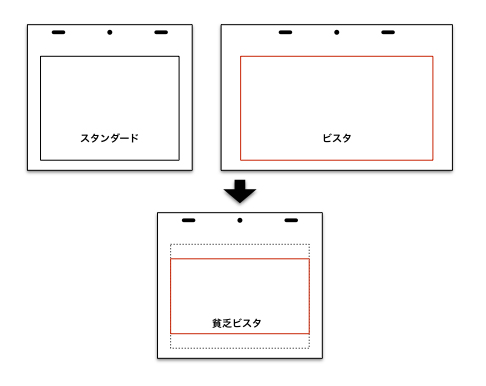

# Photography Course to Better Understand Anime \[Yoichi Izui]

#### Index - Source

* Chapter 1 — What is "Photography" in Anime? — 2016/02/08 ( [Link](https://animestyle.jp/2016/02/08/9775/) )
* Chapter 2 — Various Formats — 2016/02/15 ( [Link](https://animestyle.jp/2016/02/08/9775/) )
* Chapter 3 — Understanding Layouts and Timesheets — 2016/02/22 ( [Link](https://animestyle.jp/2016/02/08/9775/) )
* Chapter 4 — Considering Camera Work — 2016/02/29 ( [Link](https://animestyle.jp/2016/02/08/9775/) )
* Chapter 5 — Thinking About Effects (1) — 2016/03/07 ( [Link](https://animestyle.jp/2016/02/08/9775/) )
* Chapter 6 — Thinking About Effects (2) — 2016/03/15 ( [Link](https://animestyle.jp/2016/02/08/9775/) )
* Chapter 7 — Teamwork in Production — 2016/03/22 ( [Link](https://animestyle.jp/2016/02/08/9775/) )
* Chapter 8 (Final) — Anime "Photography"... — 2016/03/28 ( [Link](https://animestyle.jp/2016/02/08/9775/) )

---

## Episode 1 — What is "Photography" in Anime?

Hello everyone reading **WEB Anime Style**. Nice to meet you. My name is **Izui**, and I work in anime photography and visual effects. Thanks to the opportunity of writing about *Hibike! Euphonium* in *Anime Style 007*, I now have the chance to contribute articles here on the web version as well. Over the course of several installments, I’ll be writing about the subject of anime “photography.”

In this series, I hope to explain what the often unfamiliar “photography” section of anime production does, its role, and share some related stories. I’d be delighted if this helps readers discover the appeal of anime photography and deepen their enjoyment of anime.

For this **first episode**, I’d like to start with the question: *what exactly does “photography” do?* Today, anime photography is entirely digital. In fact, considering the workflow, the more accurate terms would be **compositing** or **composition**, and some productions already use those terms. Still, here I will stick to the traditional word **“photography.”**

---

## What is the Image of "Photography"?

When you hear “photography,” what image comes to mind? You probably imagine something about combining images, but chances to learn the details are rare. Photography is the **final gateway in anime production as an image**, and a section that ensures the **final quality** of a work. In broad terms, it carries two big roles:

* **Visual Direction**
* **Quality Assurance**

---

## Workflow: From Before Photography to Delivery

Each studio has slight differences, but the general process looks like this:

1. **Format Settings** — Decide the video specifications (TV, theater, etc.), image size, frame ratio, delivery file format.
2. **Project Meeting** — Photography director and main director decide the visual direction.
3. **Photography Meeting** — Meetings with departments (direction, animation, background, CG, etc.) to decide how materials are prepared and tasks divided.
4. **Pre-Production** — Prepare necessary materials, test, and confirm intentions.
5. **Photography Work** — Composite all materials, apply camera work, effects, and finish the video.
6. **Rush Check** — Review completed cuts before delivery.
7. **Delivery** — Send the finished video in the agreed format to the editing room.
8. **Retakes** — Corrections after delivery, based on mistakes or new directives.

Photography overlaps both **creative tasks (direction)** and **technical tasks (quality assurance)**.

---

## Details of Each Step

### 1. Format Settings

This means deciding the **final delivery specifications**. With TV broadcasts, online streaming, HD, 4K, and package releases all in play, one must select formats appropriate to the context, balancing **budget** and **workload**. Image size, aspect ratio, and scan resolution affect animation and finishing, so decisions must account for all departments. TV anime usually uses **HD digital terrestrial broadcast formats**, while original theatrical films sometimes adopt live-action frame formats (Vista, Scope, etc.). But very few works are natively produced in full HD or 2K.

### 2. Project Meeting

Also called the **first photography meeting**. Led by the director, this sets the **visual tone** of the project. The photography director considers atmosphere, lighting, and major effects. This stage determines the **overall color** of the production. When unusual or special visuals are planned, tests and development start here.

### 3. Photography Meeting

Also called a **processing meeting**. Here begins the practical work. With input from CG, background, finishing, and sometimes key animators, decisions are made on materials and division of labor. Some effects can be handled either by the photography or CG section, so choices are made based on **efficiency** and **quality**. In familiar teams, only details may be discussed, while larger directions are left to each section.

### 4. Pre-Production

Tasks include preparing **templates**, required materials, and writing **scripts** to automate effects or processing. Nearly 100% of Japanese anime today uses **Adobe After Effects (AE)**. Scripts and expressions are written in **JavaScript-based languages** that run inside AE. Some staff write their own scripts; others rely on in-house programmers. Each studio prepares its own AE scripts tailored per show. Scene settings vary (morning, evening, indoor, outdoor), creating a heavy workload. Compatibility with external studios also requires verifying AE version and plugins.

### 5. Photography Work

This is where actual **compositing** happens. Materials are placed on screen per layouts and timesheets, but adjustments are often needed. Effects (光, explosions, glows, etc.) are added, sometimes with unique touches by the photography staff — one of the joys of the job. Of course, changes must respect the director’s intent. Reading storyboards carefully is critical to upgrading quality.

Additionally, there are special cases like **Line Photography (線撮)** and **Timing Photography (タイミング撮)**:

* **Line Photography**: Recording unfinished cuts (raw key frames or in-betweens) for editing or dubbing. Includes subtitles with character names to match lines, or rough transparency work. Sometimes these appear as extras on Blu-rays. For animators, it’s a joy to see raw drawings, but for production staff, it signals schedule collapse. In extreme cases, even layout-only or storyboard-only shots are used.
* **Timing Photography**: Done with colored backgrounds and cels but without effects. Because it looks almost complete, bold text overlays like “TIMING” are added. Sometimes even preview screenings are done this way.

### 6. Rush Check

At this stage, staff check footage using both **broadcast-standard master monitors** and **consumer monitors**. Consumer displays vary by manufacturer, so the official check is always on the master monitor. Issues found here go to **retakes**. Even with cuts checked many times, oversights happen, so third-party eyes are essential.

### 7. Delivery

For TV anime, retakes often occur even during editing. FTP or HDDs are used to swap cuts up to the very last minute. Staff remain on standby at the studio until editing ends — an exhausting final sprint. (The anime *SHIROBAKO* portrayed this realistically.)

Also, the so-called **“Pokémon Check”** is performed at the editing stage. Officially called the **Harding Check**, it analyzes footage for risk of **photosensitive seizures**. Explosions or flashes may require retakes, or adjustments such as delays or brightness reduction.

### 8. Post-Broadcast Retakes

For TV, retakes occur after airing; for films, after theatrical runs, in preparation for home releases. These sometimes involve large changes. Notably, **Studio Ghibli does not allow any post-release retakes**, meaning any flaws remain forever.

---

## Closing Thoughts

As you can see, photography is not just about pressing buttons. **Pre-production meetings** are essential for quality work. Digital tech and skilled staff have enabled advanced expressions, but no good work emerges without careful preparation. Consensus across multiple studios, standardized templates, and efficient scripting are indispensable. The range of photography has expanded, making it more complex and labor-intensive. And with today’s sheer volume of productions, constant effort is required to maintain productivity.

I intended this first installment to be light, but it turned out quite long. Next time, I will talk specifically about **video formats**.

---

# Photography Course to Better Understand Anime \[Yoichi Izui]

## Episode 2 — Various Formats

This time, let’s talk about the **formats (フォーマット)** used in video production.

Many people may not immediately understand what “format” means, but think of image file types such as **JPEG (JPEG)** or **BMP (BMP)**, which you’ve surely seen before. Video also has multiple file formats, but beyond that there are rules for **broadcast formats (放送形式)**, **aspect ratios (画面比率)**, and **screen sizes (サイズ)**, all defined as standards. Here, I’ll use “format” to mean the various rules that define the completed work as a video package. Since these directly affect final delivery, photography has a large influence on format decisions. Today, new channels like streaming allow us to break away from traditional formats, and vertical videos for smartphones or panoramic 360-degree works have become common.

Regardless of the format, **the beginning and the end are crucial for maintaining quality.**

---

## Choosing the Frame

The first decision in production is the **frame (フレーム)**, which sets the aspect ratio. For Japanese anime, the main standards are:

* **TV**: 16:9 (HDTV)
* **Theatrical Vista**: 1.85:1 (ビスタ)
* **Theatrical CinemaScope**: 2.35:1 (シネスコ)

Recently, theatrical versions of TV anime sometimes keep the 16:9 format. Using Vista or CinemaScope on TV is rare outside of special direction. Different ratios affect the **final impact** of the image. CinemaScope’s wide screen increases a sense of grandeur. Numerically, the order of horizontal width is HDTV > Vista > CinemaScope, but unlike film, wider does not mean higher resolution. In all cases, the horizontal pixel count ends up around 2000.

By adjusting **scanning resolution (スキャン解像度)**, the necessary pixels can be achieved regardless of frame size. Too small a frame makes it hard to draw fine details; too large a frame increases the workload. Higher scan resolution also means longer scanning times, affecting schedules. Thus, the choice balances **efficiency** and **cost-effectiveness**. Standard animation paper sizes (作画用紙) constrain the options, though theatrical works sometimes use larger or smaller paper. A unique case: *The Tale of the Princess Kaguya (かぐや姫の物語)* avoided fixed frames, instead setting frame sizes per cut, making pencil lines relatively thicker and livelier on screen. Another example: *In This Corner of the World (この世界の片隅に)*, directed by Katabuchi, used Vista but with relatively small frames, chosen for ease of line drawing.

Usually, studios prepare layout sheets (レイアウト紙) and frames aligned to their standards. But with new ratios, these must be newly prepared. From the frame size, the required pixel resolution is calculated, then scanning resolution for animation and backgrounds is set. Slightly oversizing can provide safety margins but may waste efficiency.

### "Poor Man’s Vista (貧乏ビスタ)"

This was an old production term. It meant squeezing a Vista frame into 4:3 (4:3フレーム), making the image smaller but reusing existing TV layout paper, hence the “poor man” label. Today’s HDTV and Vista are similar in ratio, so the difference is less noticeable.

---

## Aspect Ratios Over Time

Modern TV series are 16:9, but before digital terrestrial broadcasting (地デジ), the standard was 4:3 (スタンダード/アカデミー). During the transition, as 16:9 TVs spread, works shifted formats. Early 16:9 works aired on 4:3 analog TV used **letterboxing (レターボックス)** with black bars above and below, sometimes with decorative designs (handled in the editing room, not photography). Today, when broadcasting old 4:3 works on 16:9 TVs, black or decorative side bars are added instead.

---

## Delivery Formats

At the other end, **delivery formats (納品形式)** are also important. Today, many video file formats exist, each with features. Formats are chosen based on editing studio or lab equipment. Photography directors prepare **rendering templates (レンダリング設定テンプレート)** and communicate output formats to staff.

In the past, common delivery formats were **QuickTime (QuickTime)** movie files or sequential stills like **TIFF (TIFF)** and **TARGA (TARGA)**. These required time for loading and conversion. Exporting directly in the editing system’s native format avoids wasted time, which is critical near deadlines. Sometimes smaller check files are created, but compressed formats like **MPEG (MPEG)** may distort color/contrast, so they are only temporary (used in **offline editing (オフライン編集)**, versus **online editing (オンライン編集)** for final versions). Final works are delivered as **digital video tapes (デジタルビデオテープ)** for TV or as **DCP (Digital Cinema Package)** for theaters.

---

## Resolution in Practice

Surprisingly, many productions are not made in full HD (フルHD) at the source. High-budget works may be produced in Full HD or 2K (２Ｋ), but many are upscaled later. Sometimes, even Full HD sources are deliberately resized to soften the overly sharp look of digital. Terrestrial broadcasting standards (地上デジタル) use 1440×1080 resolution (BS digital uses 1920×1080). For viewers, quality issues are rarely noticeable. Problems like **tone jumps (トーンジャンプ)** or **block noise (ブロックノイズ)** usually come from broadcast compression, not original data. Blu-rays and DVDs correct these issues.

Looking ahead, with **4K (４Ｋ)** adoption rising, digital artwork and digital drawing (デジタル作画) spreading, and tools advancing, production will gradually shift to Full HD. But true **native 4K production (フル４Ｋ制作)** is still some way off.

---

## Closing

This was a rather technical discussion. Next time, I’ll talk about **layouts (レイアウト)** and **timesheets (タイムシート)**, which directly connect to actual photography work.

---

# Photography Course to Better Understand Anime \[Yoichi Izui]

## Episode 3 — Understanding Layouts (レイアウト) and Timesheets (タイムシート)

From this episode, we move into **practical work**. First, we focus on **layouts (レイアウト)** and **timesheets (タイムシート)**, essential tools in anime production. In short:

* **Layout (レイアウト)**: instructions for screen composition
* **Timesheet (タイムシート)**: instructions for timing

These documents guide photography work; without them, production cannot proceed.

---

## Layouts (レイアウト)

Layouts are crucial for designing the actual screen. Based on **storyboards (絵コンテ)**, key animators (原画担当) or **layout artists (レイアウター)** draw compositions, character movements, and placements on **layout sheets (レイアウト用紙)**. These sheets are often seen in anime publications or exhibitions. Like animation sheets (動画), they have **registration holes (タップ穴)** and printed **frames (フレーム)**.

Paper quality varies by studio. Some have glossy fronts and rough backs; some animators prefer drawing on the reverse side for ease. Layouts include not only visual elements but also **camera work (カメラワーク)** and other directorial instructions for photography, including **book directions**, **lighting from off-screen**, and **effects (エフェクト)**. Photography staff build the final data based on these instructions.

Layouts are usually included in **cut packets (カット袋)**, but in practice, the scanned layout data is used alongside video scans to align frames precisely. Backgrounds (背景) also contain layouts to indicate placement, but their resolution may differ from cells, requiring scaling adjustments.

**Camera work (カメラワーク)** information includes start/end positions, directions, and speed. Instructions may be modified with marks, so attention is needed. While some frames have drawn guides, exact ratios or positions are not guaranteed; placement is determined by comparing with actual materials. Minor adjustments, including Photoshop (Photoshop) retouching, may be necessary to maintain visual balance. Photography requires both technical skill and visual judgment.

Effects and visual enhancements are essential; general guidance is in the layout, e.g., **light source positions** and blur (**ぼかし**) instructions. Detailed numeric values are rarely specified; for example, blur may be indicated as large, medium, or small. Sometimes, directors or animators provide Photoshop samples as reference. More detailed effect instructions are determined in separate photography meetings (撮影打ち合わせ).

---

## Timesheets (タイムシート)

Timesheets instruct the sequential order of **cells (セル)**. They contain all timing information. Typically printed on B4 or A3 thick paper with grids, pastel-colored inks (pink, green, yellow) are used by studio. Large sheets allow folding to insert layout and animation sheets. Color aids visibility, especially in dim conditions during the film era.

Grids resemble spreadsheets: vertical axis = time, horizontal axis = cell order. A sheet covers six seconds; modern digital sheets may cover three seconds to allow unlimited cell layering. Timesheets include cell order, overlaps, fade-ins/outs, and camera speed/timing adjustments. They are complex, resembling a code, and newcomers often struggle to read them.

In practice, cells are arranged according to the timesheet. Data is imported sequentially into **After Effects (AfterEffects)**, keyframes are applied for timing. One-frame entry is inefficient, so scripts or dedicated tools like **Rimapin (りまぴん)** are used, allowing copy-paste of timesheet data. These automate repetitive entry even for long cuts. Special attention is needed if frame numbers or order are irregular.

Sometimes, due to schedule delays, only scanned sheets or black-and-white copies are available, lowering visibility. Notes or additional instructions may be on the sheet or its reverse, including sketches, speed curves, or in-between diagrams. While these are interpretive, they convey the intended feeling, aiding photography.

Photography requires interpreting not just individual cuts but the story flow and directorial intent from storyboards. This bridging function makes layouts and timesheets crucial tools linking direction, animation, and photography.

With increasing **3DCG (3DCG制作)** and **digital drawing (デジタル作画)**, the role of sheets may change, raising questions on how to convey instructions across sections in multi-studio production.

---

Next episode: **Camera Work (カメラワーク)**.

----

Falta todo a partir del 4

