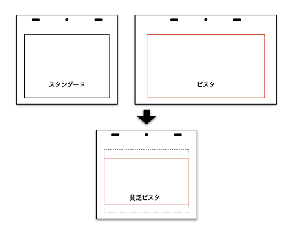

# Anime "photo"-"shoot" Course to Better Understand Anime \[Yoichi Izui]

## Episode 2 — Various Formats

This time, let’s talk about the **formats (フォーマット)** used in video production.

Many people may not immediately understand what “format” means, but think of image file types such as **JPEG (JPEG)** or **BMP (BMP)**, which you’ve surely seen before. Video also has multiple file formats, but beyond that there are rules for **broadcast formats (放送形式)**, **aspect ratios (画面比率)**, and **screen sizes (サイズ)**, all defined as standards. Here, I’ll use “format” to mean the various rules that define the completed work as a video package. Since these directly affect final delivery, photography has a large influence on format decisions. Today, new channels like streaming allow us to break away from traditional formats, and vertical videos for smartphones or panoramic 360-degree works have become common.

Regardless of the format, **the beginning and the end are crucial for maintaining quality.**

---

## Choosing the Frame

The first decision in production is the **frame (フレーム)**, which sets the aspect ratio. For Japanese anime, the main standards are:

* **TV**: 16:9 (HDTV)
* **Theatrical Vista**: 1.85:1 (ビスタ)
* **Theatrical CinemaScope**: 2.35:1 (シネスコ)

Recently, theatrical versions of TV anime sometimes keep the 16:9 format. Using Vista or CinemaScope on TV is rare outside of special direction. Different ratios affect the **final impact** of the image. CinemaScope’s wide screen increases a sense of grandeur. Numerically, the order of horizontal width is HDTV > Vista > CinemaScope, but unlike film, wider does not mean higher resolution. In all cases, the horizontal pixel count ends up around 2000.

By adjusting **scanning resolution (スキャン解像度)**, the necessary pixels can be achieved regardless of frame size. Too small a frame makes it hard to draw fine details; too large a frame increases the workload. Higher scan resolution also means longer scanning times, affecting schedules. Thus, the choice balances **efficiency** and **cost-effectiveness**. Standard animation paper sizes (作画用紙) constrain the options, though theatrical works sometimes use larger or smaller paper. A unique case: *The Tale of the Princess Kaguya (かぐや姫の物語)* avoided fixed frames, instead setting frame sizes per cut, making pencil lines relatively thicker and livelier on screen. Another example: *In This Corner of the World (この世界の片隅に)*, directed by Katabuchi, used Vista but with relatively small frames, chosen for ease of line drawing.

Usually, studios prepare layout sheets (レイアウト紙) and frames aligned to their standards. But with new ratios, these must be newly prepared. From the frame size, the required pixel resolution is calculated, then scanning resolution for animation and backgrounds is set. Slightly oversizing can provide safety margins but may waste efficiency.

### "Poor Man’s Vista (貧乏ビスタ)"

This was an old production term. It meant squeezing a Vista frame into 4:3 (4:3フレーム), making the image smaller but reusing existing TV layout paper, hence the “poor man” label. Today’s HDTV and Vista are similar in ratio, so the difference is less noticeable.

---

## Aspect Ratios Over Time

Modern TV series are 16:9, but before digital terrestrial broadcasting (地デジ), the standard was 4:3 (スタンダード/アカデミー). During the transition, as 16:9 TVs spread, works shifted formats. Early 16:9 works aired on 4:3 analog TV used **letterboxing (レターボックス)** with black bars above and below, sometimes with decorative designs (handled in the editing room, not photography). Today, when broadcasting old 4:3 works on 16:9 TVs, black or decorative side bars are added instead.

---

## Delivery Formats

At the other end, **delivery formats (納品形式)** are also important. Today, many video file formats exist, each with features. Formats are chosen based on editing studio or lab equipment. Photography directors prepare **rendering templates (レンダリング設定テンプレート)** and communicate output formats to staff.

In the past, common delivery formats were **QuickTime (QuickTime)** movie files or sequential stills like **TIFF (TIFF)** and **TARGA (TARGA)**. These required time for loading and conversion. Exporting directly in the editing system’s native format avoids wasted time, which is critical near deadlines. Sometimes smaller check files are created, but compressed formats like **MPEG (MPEG)** may distort color/contrast, so they are only temporary (used in **offline editing (オフライン編集)**, versus **online editing (オンライン編集)** for final versions). Final works are delivered as **digital video tapes (デジタルビデオテープ)** for TV or as **DCP (Digital Cinema Package)** for theaters.

---

## Resolution in Practice

Surprisingly, many productions are not made in full HD (フルHD) at the source. High-budget works may be produced in Full HD or 2K (２Ｋ), but many are upscaled later. Sometimes, even Full HD sources are deliberately resized to soften the overly sharp look of digital. Terrestrial broadcasting standards (地上デジタル) use 1440×1080 resolution (BS digital uses 1920×1080). For viewers, quality issues are rarely noticeable. Problems like **tone jumps (トーンジャンプ)** or **block noise (ブロックノイズ)** usually come from broadcast compression, not original data. Blu-rays and DVDs correct these issues.

Looking ahead, with **4K (４Ｋ)** adoption rising, digital artwork and digital drawing (デジタル作画) spreading, and tools advancing, production will gradually shift to Full HD. But true **native 4K production (フル４Ｋ制作)** is still some way off.

---

## Closing

This was a rather technical discussion. Next time, I’ll talk about **layouts (レイアウト)** and **timesheets (タイムシート)**, which directly connect to actual photography work.

