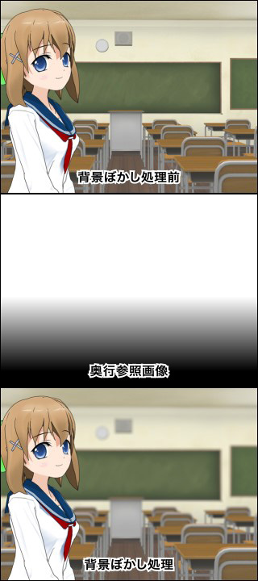
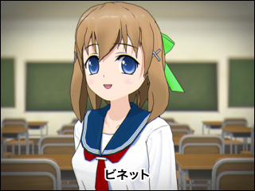

# Anime "photo"-"shoot" Course to Better Understand Anime \[Yoichi Izui]

## Episode 6: Considering Effects (2) (エフェクトを考える（２）)

Continuing the story about effects. In the previous column I divided effect classification into "environmental recreation" and "creative direction," writing about environmental recreation, but this time I'd like to explain creative direction. Let's define creative direction here as creating phenomena that don't exist in reality as expression and proceed with the discussion.

Effects classified as creative direction first include flashy expressions like explosions and attacks. Since these have been used from relatively early stages, even within digital anime production, expression methods are diverse with abundant variety.

For beams and such, the basics involve using transmitted light (透過光) expressions introduced last time on animation-based materials to make them appear like light rays. Recently these are combined with plugin flare, particles, and 3D materials to create complex, impactful expressions.

For magic, there are many expressions using effects to show magical power gradually building during incantation before activation. Bullet rapid-fire expressions traditionally done with animation, and circular or crescent-shaped light blinking representing distant battles in space, can now be expressed with particles.

Various effects are used for explosion expressions when receiving attacks. Not only transmitted light and vibration at explosion moments, but blur effects are added to reinforce explosion impact and light impressions. To suggest air refraction from burning heat and gravitational distortion, fluctuations are often added to screens. This is called ripple glass effect (波ガラス効果). This uses plugins that give screen fluctuations or fractal noise (フラクタルノイズ) introduced last time as reference images to add rippling effects.

Smoke is also expressed by blurring materials created with animation or fractal noise using blur and layering them multi-dimensionally. Adding changes to movement, shape, and transparency at this time further adds realism.

What requires attention with explosions is the infamous Pokemon check. Care is needed with brightness and area of bright parts and blinking timing to avoid triggering checks.

Another commonly used effect for movements where something emerges breaking through smoke or clouds is deformation effects (変形のエフェクト). For example, when some object breaks through smoke, centering on the appearing object, smoke materials need to be deformed as if blown away by pressure, pulled outward. Adding rotating movement at this time makes it look even more effective. Such seasoning is where photography staff sense is tested.

Next, let's cover expressions of places that don't exist in reality, like cyberspace or alternate dimensions.

Since these are imaginary spaces, we construct expressions with different logic from environmental recreation covered last time. Even in real space, depictions like monitors floating in air (user interfaces) can be counted among such expressions.

In special spaces, environmental light (環境光) explained last time varies - sometimes influential, sometimes not. When expressing cyberspace, we commonly see depictions where abstract elements designed within the space are arranged three-dimensionally in large numbers, each independently moving and glowing under control. Simple versions can be expressed using 3D layers within After Effects, while complex ones require creation with 3D software.

Recently, depictions showing numerous text information on monitors within screens are also common. So specialized roles are often established for this. While names vary - monitor graphics, monitor design, motion graphics - they handle various graphics like computer screens and magic circles in the work. Let's touch on this again next time.

A common expression in cyberspace is digital noise depiction. This spans widely: monitor scan line-like expressions, sandstorm noise, random noise during offensive/defensive battles. Sometimes general noise materials are prepared in advance, sometimes generated within software. On top of that, multiple effects are layered for complex expressions. Mosaic and such are also indispensable for expressing digital-ness, but care is needed to prevent screens from becoming monotonous by using them with some other effects.

For digital space expressions, rather than being static, having elements suggesting constant data fluctuation - like numerical changes or sizzling noise-like changes somewhere on screen - makes them more authentic.

For alternate dimensions, ominous ones or conversely sacred atmosphere ones mainly use abstract expressions. Processing elements might be fewer than cyberspace. For ominous ones, we apply processing like ripple glass-like fluctuations to backgrounds and adding suspicious fog. For sacred spaces, we apply light processing like adding rainbow-colored soft flare and strengthening diffuse. Sometimes floating hazy light orbs with particles.

Such processing is largely image-based, so when used frequently, advance meetings including settings and art are needed for decisions. However, for one-time uses, it becomes flexibly creating atmosphere required for that cut.

Even without going as far as alternate dimensions, gag-like expressions of adding movement to backgrounds for shaking and glowing are commonly seen. Similar expressions include concentration lines expressing emotion and momentum, and wind-like depictions flowing up-down-left-right. While extremely symbolic effects, they're indispensable for giving dynamism to motionless cuts and reinforcing characters' (and viewers') emotions. These could be called manga-derived expressions. It's interesting how expressions created to express movement in originally motionless manga are incorporated and used in anime that originally moves. Such expressions tend to be frequently used in cuts with little movement and slow-motion cuts, making them manga-like in that sense too.

Sometimes these are expressed with art alone, preparing so-called "flowing pan" (流パン) backgrounds. These are drawn with landscapes flowing at high speed, but photography can also create flowing pan-like backgrounds by applying large horizontal blur to normal backgrounds.

Let's also touch on lens effects.

As explained in "Anime Style 007," this covers all effects that make anime appear as if shot with real cameras. Specifically, reproducing various phenomena appearing when viewed through lenses on screen. These are expressions with strong directional meaning that can become very impressive screens depending on usage.

Representative examples are focus expressions. When people are at back and front, one is in focus while the other is blurred. This commonly seen technique can relatively easily direct space within originally flat anime. There's also an expression called focus pulling (ピン送り) that gets shot-reverse-shot-like effects in one cut by alternately focusing on back and front targets.

This focus expression has escalated further, and recently works incorporating extremely shallow depth of field (被写界深度) have emerged. Depth of field refers to the range of how far front and back from the focused center remains in focus (narrow focus range is expressed as "shallow depth of field"). Recently, extremely shallow depth of field expressions have appeared where not just front-back but even within a person's face, eyes and nose tip have different focus. While live action influence is probably large, doing this carefully creates atmospheric "good feeling" screens. The effect of clearly showing parts you want to emphasize within targets is also significant.

Such expressions are basically done with plugins reproducing lens defocus. Focus ranges are specified with gray gradations, adjusting blur range and blur degree according to gradations. Since lens blur plugins include optical simulation, they can be used to apply realistic blur with depth feeling matching perspective against backgrounds. This is widely done as one spatial emphasis expression.

Another commonly seen expression is vignette (ビネット) - reducing light at screen corners. This is a phenomenon prominently seen with old lenses, wide-angle lenses, and long focal length telephoto lenses. By extremely darkening surroundings, it's often used for flashback scenes. In such cases, colors are often made sepia-toned or film noise-like elements added. It's also used to direct narrow vision or nostalgic impressions, or to make targets stand out with frame effects. Photography-wise, we create corner-blurred masks and suppress exposure or add colors.

Chromatic aberration (色収差), a color shifting phenomenon, is also commonly used. This has two types: optical and electrical. Optical ones occur from light refraction passing through lenses. Used with processing like screen distortion and low resolution as expression for strong prescription or poor quality lenses. Electrical ones include footage where dubbing is repeated and color signals shifted, and footage on old CRT monitors. Besides being used for such expressions, they're used for stylish footage like openings and endings, aiming for pop effects like printing registration errors. Expressed through plugin use and RGB channel operations.

We also see expressions of irregular reflection from dirt and dust on lens surfaces. When strong light hits lenses, dirt diffuses light and appears as light bokeh balls on screen. Expressed by using plugins or creating and layering materials. When briefly entering screens during strong light, light impressions strengthen more and realism emerges. However, overuse can create noisy impressions, so usage timing requires attention.

Similar expressions include what's called orb. Rain or dust in space outside focus appears as light bokeh balls through irregular reflection. Lens dirt is attached to surfaces (supposedly) so it's fixed at the same screen position without movement, but orbs exist in space so they move. However, as fantastical expression, they're sometimes inserted image-wise into screens without being bound to such realism.

In *Hibike! Euphonium*, using such effects together created impressions as if shot with old lenses. In issue 007's article, for explanation convenience I arbitrarily named it "old lens effect," but there's no photography effect with this name. Various expressions are created and layered according to situations.Chromatic Aberration

Next, let's touch on texture expressions.

This is literally work adding texture to cel materials. In recent anime, character eye transparency, cheek blurred redness, hair and skin expressions are added in photography.

For blurring colors, plugins that can selectively blur only specific color boundaries are used. Combined with masks, even more complex expressions are possible. Using textures to add unevenness can also change flat cel surfaces.

Such work was previously handled by "special effects" (特効) sections specializing in texture expression. However, recently it's more often applied during photography using plugins or processing based on animation-prepared materials.

However, when wanting to add complex realistic textures or applying effects to licensing art (版権絵) for magazines and posters, special effects sections still have their turn.

Roughly, things that move a lot are handled by photography, while non-moving or low-movement things are special effects, but there are texture expressions that can only be applied by hand - in such cases special effects staff draw texture frame by frame.

Recently some works apply considerable texture, sometimes changing texture settings scene by scene, so scripts automate procedures for work efficiency.

Adding texture expressions allows closer taste to originals with illustrations like light novels. Various other expressions like old cel painting style, watercolor style, thick painting style have also become possible. However, this also connects to increased work volume.

Finally, while this deviates from directional aims, since there's no other opportunity to cover it, let's touch on it. While there's no fixed name, let's call it "hiding" (隠し) here.

As the name suggests, it's hiding parts you don't want to show. Specifically, hiding cruel depictions or adult expression parts. For hiding methods in realistic works, we naturally place shadow-like things on screen or place strong lights as much as possible. Making bath steam thicker or lowering hot water transparency to make character body silhouettes less noticeable are quite familiar expressions.

For gag works, there are cases of hiding with symbolic marks of the work or cards saying NG. Since these just overlay from above, some might be added at editing rather than photography stage.

Goes without saying, but when clearly NG things appear on screen, "hiding" is already done at direction design stage (referring to things like bubbles at bust tops or leaves growing at exquisite positions in front of naked figures).

So over two installments I've written various things about effects. There are still many cases I couldn't fully cover. This shows how digital photography has enabled diverse expressions across many fields. Effect creation methods are also extremely varied and impossible to fully explain, but CG magazines and seminars provide introductions following specific examples. Those wanting to know more details should visit such places.

Let's stop here this time. Next time let's touch on coordination between photography and other departments.
