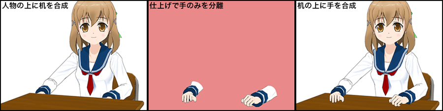

# Anime "photo"-"shoot" Course to Better Understand Anime \[Yoichi Izui]

## Episode 7: Work Coordination (作業の連携)

While previous episodes focused on effects-related topics, this time I'd like to introduce coordination with other departments involved in effects and photography work in general, along with their work content. In animation work, not just photography but every department coordinates with other departments. However, since photography involves gathering all materials, it naturally has the most coordination with other processes.

First, let me roughly summarize the key coordination points by department:

**Animation:** Material separation, frame confirmation, simulation  
**Art:** Material separation, frame confirmation, composite materials  
**Finishing:** Transparency light masks, composite materials  
**Special Effects:** Texture materials  
**CG:** 3DCG cell materials, backgrounds, effects  
**Monitor Graphics:** Monitor design, text design

In addition to these exchanges regarding materials actually needed for photography, there's also preliminary confirmation work through simulation. Let me explain each individually.

First, regarding exchanges with animation, there's material separation. When effects are added during photography, cell separation may be required, necessitating meetings before animation begins. Normally, without specific instructions, animation proceeds without cell separation, so it's necessary to confirm this thoroughly with the director during photography meetings.

Frame confirmation is needed when screen scaling occurs due to zoom or track back shots. To prevent image quality degradation, drawings must be made at larger sizes, requiring frame size confirmation and sizing work. Simulation is performed using layouts when directors or key animators want to confirm camera work or speed in advance.

Designing movement for large-format animation becomes difficult to correct if it fails, so preliminary confirmation is best. However, whether simulation is performed naturally depends on schedule. Simulation also confirms ranges where frame bleeding doesn't occur. Results are printed out and distributed to animation and art departments.

Exchanges with the art department regarding material separation and frame size confirmation are similar to animation. For art, books are often already specified due to animation and camera work requirements, but there are also cases where photography makes additional requests. A recent concern is composite material issues. Currently, most backgrounds are assembled in Photoshop, but when complex layer structures and mask compositions use composite modes, problems can occur where the original state isn't reproduced when imported into After Effects, or effects aren't reflected. To prevent such troubles, we need to communicate precautions in advance.

Also, creation of composite materials has increased recently. This involves compositing background textures onto animated cels, and we request materials for this purpose. For example, it's used for wooden doors or desk drawers (composite materials for books and newspapers are often prepared as cel materials). Ideally we could specify size and shape to minimize waste, but this also depends on schedule.

Next, exchanges with finishing. We particularly coordinate on color separation and cell separation for parts used as masks within cels. Parts that receive processing during photography are separated by color for extraction work, distinguished with special colors that are easily differentiated from others. Representative examples are drop shadow and transparency light masks. Both are painted in clearly distinguishable colors like pink or green to prevent processing oversights or mix-ups during photography. These are established as general finishing conventions, so meetings aren't necessary, but for other special processing requiring cell separation, we meet in advance like with animation and art to request material separation.

Additionally, "composite" work is important. Composite refers to techniques used when foreground-background relationships occur simultaneously within cels. For example, when a character sits at a desk with their body behind the desk and hands moving on top of (in front of) the desk. In this example, the desk and body are drawn separately as materials, then during finishing the arm portion is separated from the body material and layered during photography. When necessary composite separation materials are missing, we create masks during photography to handle it.

Additionally, for expressions utilizing pencil lines like in *The Tale of Princess Kaguya*, detailed meetings are necessary in advance to determine what materials are needed. This directly affects work site efficiency and final quality.

Regarding special effects, I touched on this briefly last time. During the special effects stage, special textures are mainly drawn using Photoshop. In photography, we receive finished materials and use them as-is. So there isn't frequent back-and-forth. However, when having composite materials or particle materials drawn, we need to communicate requirements and have the work done. Also, when composite modes are used, similar precautions as with art are necessary.

Next is 3DCG. Coordination with CG departments is particularly increasing currently. There are cuts that are entirely CG rather than entirely cel, and the proportion and exchanges will likely continue increasing.

Basically, exchanges are similar to animation. However, since materials come completed with color, cell separation for effects and necessary mask material output occur, similar to exchanges with finishing.

Since CG allows easy separation by elements, objects' colors, shadows, highlights, environmental light, etc. can be output separately. Utilizing this, when necessary materials exist, we request output of those materials. Also, when composite situations occur, if the composite elements themselves are created in CG, they can be used as-is.

In anime, CG materials are often delivered to photography already assembled to some degree in After Effects. We add necessary effects based on that. In such cases, we don't need to input timesheets ourselves.

Note that for cel-look 3DCG works, various process changes likely occur, but since there aren't many examples yet and my personal experience is limited, I'll omit this from this column m(_ _;)m

Monitor graphics is a relatively new department. As I mentioned briefly last time, the name varies by work and company.

Previously, monitor-related work was performed within photography departments, but as content became complex and work volume increased, it likely separated as a specialized position. Sometimes it's combined with special effects roles.

This work mainly uses Illustrator and Photoshop to create moving graphic elements called motion graphics that appear in works. Basically, they create everything from design to movement based on orders from the direction side.

They handle diverse materials: UI designs and text information displayed on monitors and helmet visors, magic circles, sign text, etc. However, text attached to backgrounds is mostly created in the art section. Since work color and staff member sense determine design direction, ideally the same person handles the same work, but there are still few people in charge, and the burden seems large. Sci-fi works have particularly numerous monitor expressions and must be challenging.

Monitor display materials are basically delivered to photography as After Effects data, but sometimes as sequential images or movie formats.

For materials reused in productions, After Effects data can be reused by replacing embedded materials. This is used for interfaces that are the same but have different content. General-purpose materials are created viewed from the front, so according to scenes, photography performs fine adjustments like transforming, adding light, or adjusting color tone.

Beyond what I've covered, there are positions called digital effects or visual effects. Depending on companies, these may be independent departments. Some individuals have their names in end credits.

Separate from general effects used in works, these position names are used when creating special effects or handling special scenes within works. Since photography work volume is enormous, being tied up with time-consuming special effect creation or screens that can only be made with directors working closely could impact schedules. So these specialists appear. They're involved from scene design and compared to normal photography sections, more closely involved in expression aspects for specific scenes or cuts.

I've explained things roughly above, but actually each department coordinates as needed while advancing work. Since they're often not on the same premises or are different companies, advance agreements and communication during work are very important. For this reason, though I didn't explain it here, production work becomes very important. In *SHIROBAKO*, scenes were depicted where production staff's vague attitudes brought confusion to work sites. While exaggerated, it's not entirely unrealistic. Production is like a site hub, so when it doesn't function properly, things become very troublesome. Sometimes sites make independent judgments due to insufficient time, but even then, to avoid unnecessary confusion, it's necessary to properly communicate with production.

That's all for this time. This column will end next time. In the final episode, I plan to cover things I couldn't write completely and supplementary content.

(2016.04.21)
